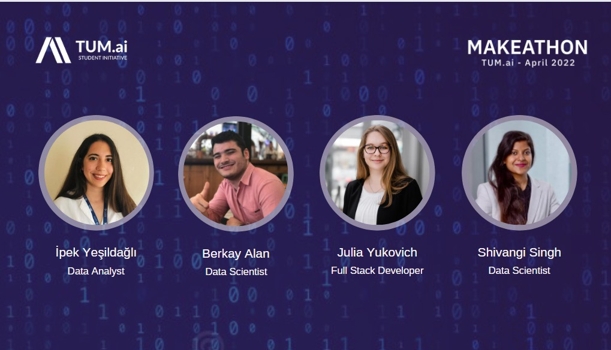

# TUM.ai Makeathon

TUM.ai Makeathon is a 48h virtual challenge that connects young innovators with different backgrounds to develop AI solutions for real-life business cases.

Makeathon is a 48-hour virtual challenge in which motivated students and young professionals develop a working AI solution for a real-world business case. Innovators of tomorrow work together in interdisciplinary teams on developing a prototype for the challenges in Education, Environment, and MedTech tracks. As the largest student-organized Makeathon in Germany, you can expect numerous exciting speakers, challenges, cool prizes, and excellent opportunities to meet like-minded people and connect with industry leaders, start-ups, and research groups. Due to the ongoing Corona Pandemic, all events will be held online.

## Let us introduce our amazing team: Techmakers

## Connect with our Team : Databled

- [Shivangi Singh](https://www.linkedin.com/in/shivangi-singh-59a8b779/)
- [Berkay Alan](https://www.linkedin.com/in/berkayalan/)
- [İpek Yesildagli](https://www.linkedin.com/in/ipekyesildagli/)
- [Julia Yukovich](https://www.linkedin.com/in/julia-yukovich-07b8891b9/)

