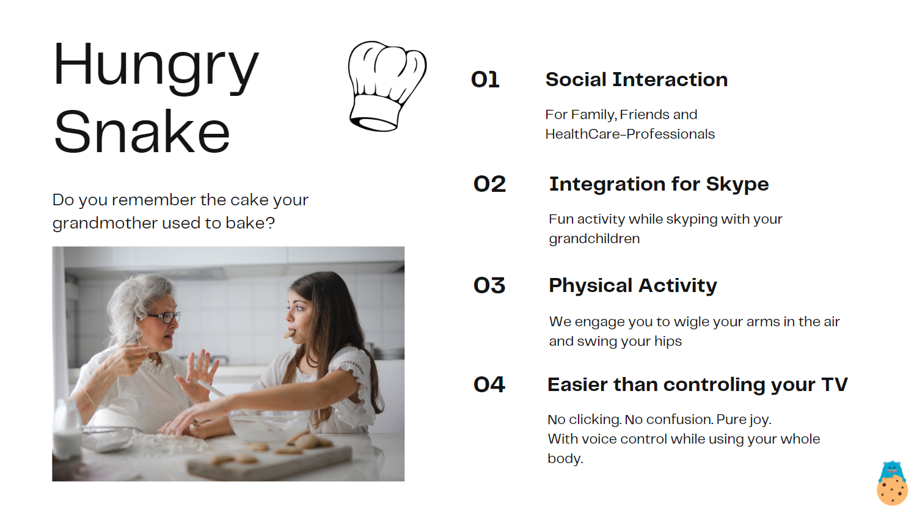
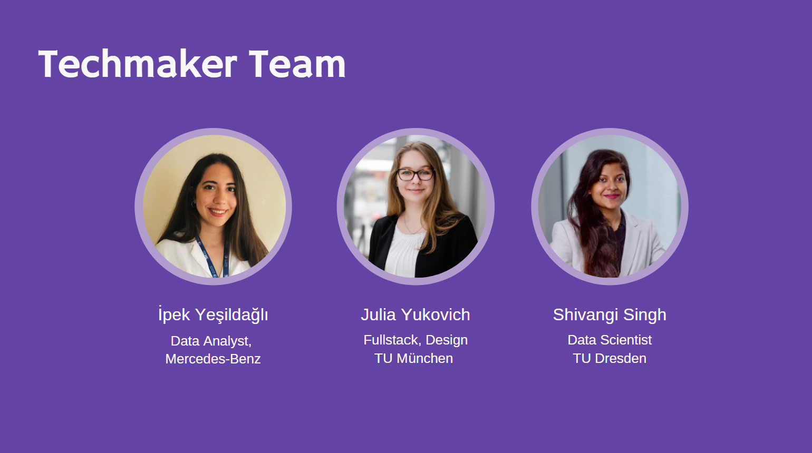

# TUM.ai Makeathon

TUM.ai Makeathon is a 48h virtual challenge that connects young innovators with different backgrounds to develop AI solutions for real-life business cases.

Makeathon is a 48-hour virtual challenge in which motivated students and young professionals develop a working AI solution for a real-world business case. Innovators of tomorrow work together in interdisciplinary teams on developing a prototype for the challenges in Education, Environment, and MedTech tracks. As the largest student-organized Makeathon in Germany, you can expect numerous exciting speakers, challenges, cool prizes, and excellent opportunities to meet like-minded people and connect with industry leaders, start-ups, and research groups. Due to the ongoing Corona Pandemic, all events will be held online.

## What we want to achieve:
We present you an application enabeling everyone to stay in touch with their loved ones and joying the time together while taking care of their health. Our mission is to support familiys in stopping the constant worry for their parents or grandparents.
Especially elder people have trouble keeping up with all the changes regarding their pyhsical and cognitive state. We help and offer an application you can easly integrate in your weekyl skype calls, observe changes and have fun while exercising seniorfriendly. In a later stage we want to enable fun rehabilitation in the medical area and work together with healthcare-institutions. Raising social interaction between seniors, across generations and 

## Let us introduce our amazing team: Techmakers

## Connect with our Team : Techmakers

- [Shivangi Singh](https://www.linkedin.com/in/shivangi-singh-59a8b779/)
- [İpek Yesildagli](https://www.linkedin.com/in/ipekyesildagli/)
- [Julia Yukovich](https://www.linkedin.com/in/julia-yukovich-07b8891b9/)

